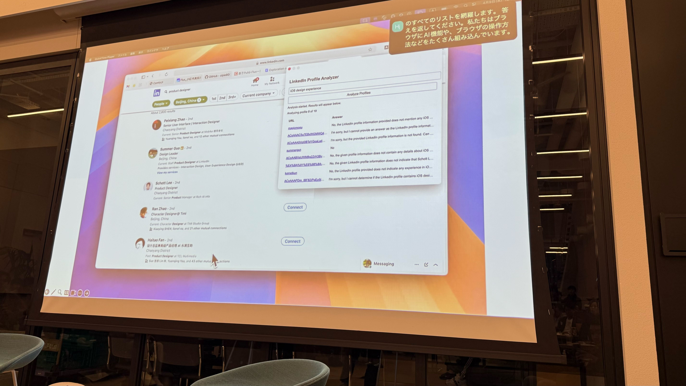
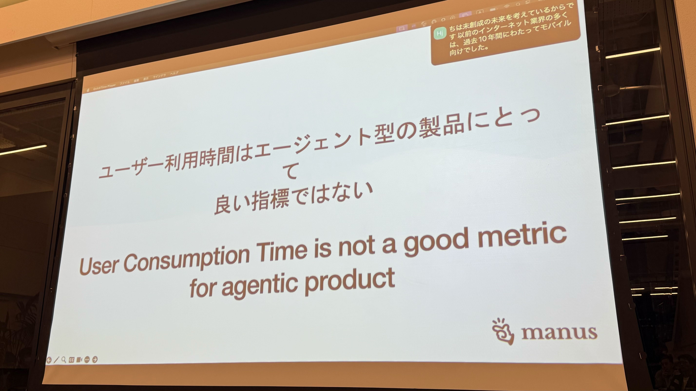
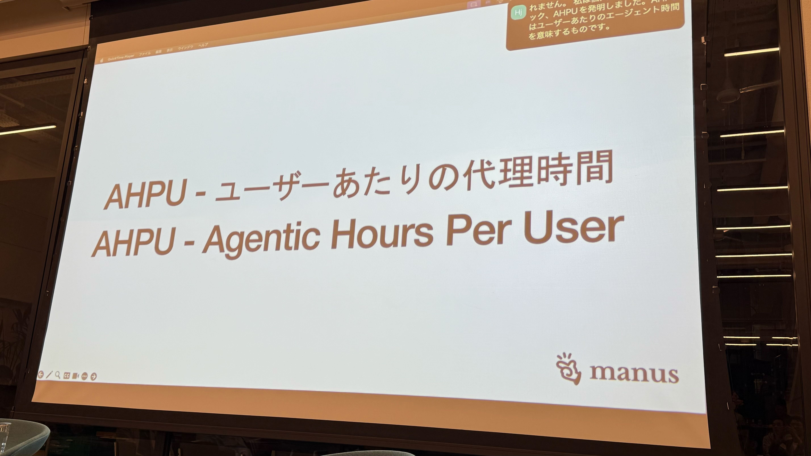
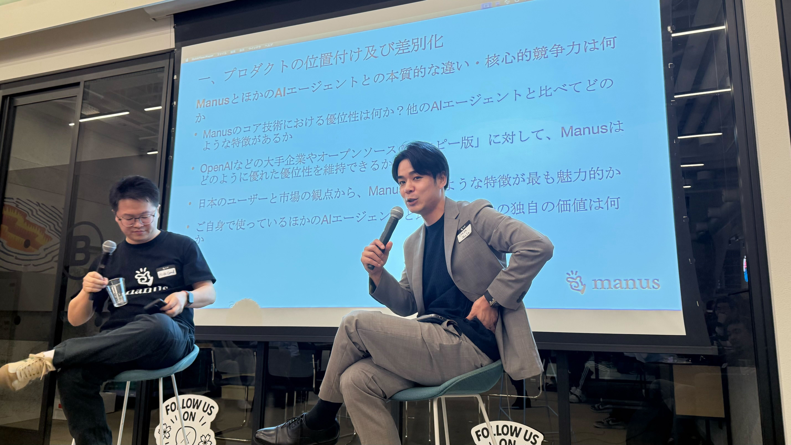
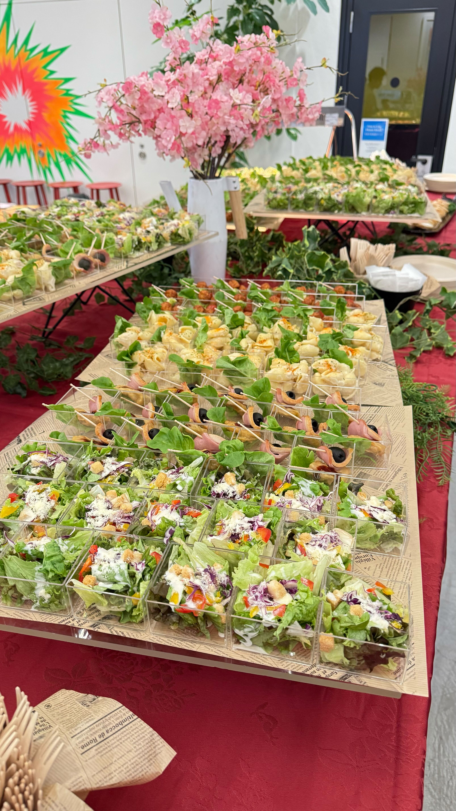
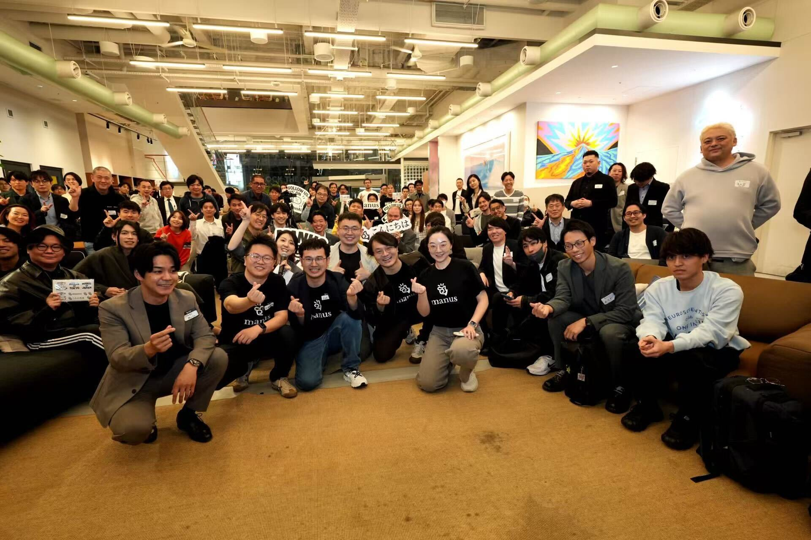

# Attending Manus’s First Event in Japan 🇯🇵

Yesterday, I had the chance to join the first-ever [Manus](https://manus.im/?index=1) event held in Tokyo, and I’d like to share my impressions.

## Event Overview

The event kicked off with Manus’s CPO talking about the origin, development stories, and design philosophy behind Manus. What surprised me most was that, before releasing Manus, the team actually built an AI-driven browser.

They initially developed a Chrome extension, but since it depended on Chrome, they decided to build a standalone browser. After six months of development, they were just a week away from launch when they chose to cancel the project.

It turned out that when the AI was processing, the browser would lock up and prevent any other tasks, effectively taking over the entire browser. So they decided to abandon the browser project—and that decision ultimately led to the creation of Manus.

## AHPU: Agentic Hours Per User

Most SaaS companies focus on increasing users’ time spent on their platforms. Manus takes the opposite approach: reducing the time users spend. The CPO argued that “time spent” is not a good metric.

Because Manus continues working even after you close your laptop, you can spend time on chores, family, or anything else. This is the core idea behind AHPU (Agentic Hours Per User)—the hours your agent works on your behalf.

The CPO also shared some heartwarming user feedback: a mother of three working in San Francisco said that using Manus to create documents gave her more time to spend with her children.

It’s been about a month since Manus launched, and the response has been overwhelming. User numbers are growing rapidly, and the CPO can’t contain their excitement.

They’ve only been sleeping two to three hours a night for the past month and are understandably exhausted—yet they’re still smiling. It’s clear how passionate and excited they are about what they’re building.

## Conversation with the CPO and Mr. Chaen

In the second half, the CPO joined Mr. Chaen for a Q&A session, answering questions submitted in advance.

The CPO revealed plans to open a Tokyo office and deploy servers in Japan, in partnership with AWS, to meet security and data management requirements for Japanese enterprises.

Mr. Chaen, who regularly shares AI insights as an exclusive seminar instructor for GMO Internet Group employees, was also there in person—it was the first time I’d met him face-to-face, and his energy was infectious.

The food at the event was also top-notch! 🍽️

## Conclusion

Connecting directly with people on the front lines of the AI era was an incredible experience. The concept of AHPU shared by the Manus CPO was particularly fascinating.

Hearing how the team, though exhausted from sleepless nights, remains thrilled by the excitement of the moment left a lasting impression.

Manus events will continue in the future—if you’re interested, I highly recommend attending. It’s a rare opportunity to experience the cutting edge of AI technology firsthand.

