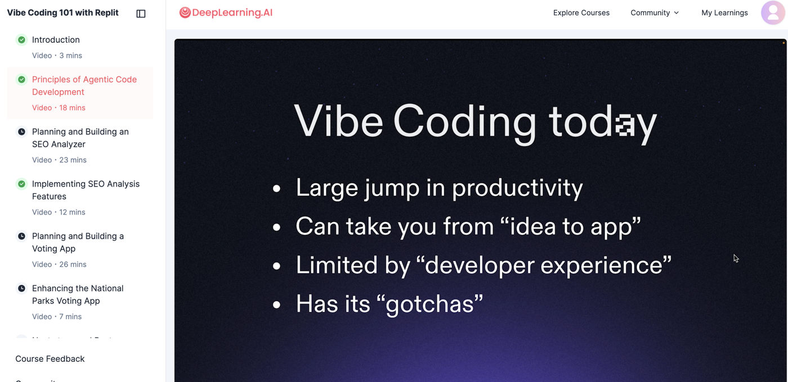
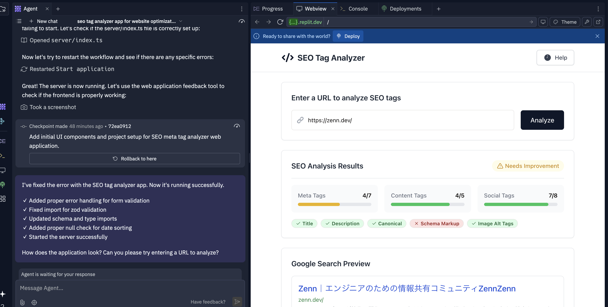
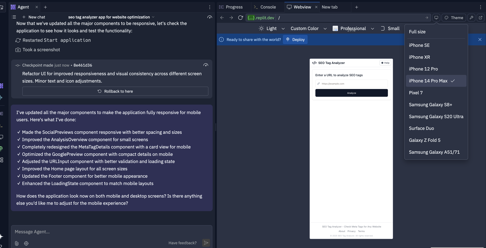
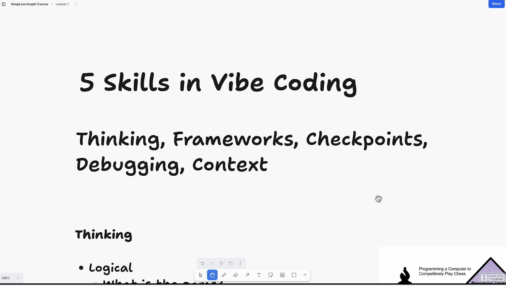
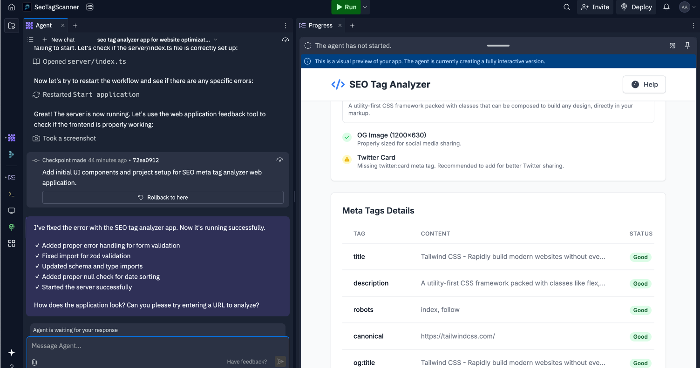

# Experiencing Vibe Coding - Building Web Apps with AI Agents

Hello, I'm Atsushi from the SRE team at GMO Media. In this article, I'd like to share my experience taking the "[Vibe Coding 101 with Replit](https://www.deeplearning.ai/short-courses/vibe-coding-101-with-replit/)" course offered by DeepLearning.AI and building sample applications with AI agents.

## What is Vibe Coding?

"Vibe Coding" is a new coding style where you delegate most of the coding work to AI agents while focusing on application architecture and feature design. It's not just about throwing a prompt at an AI and accepting all its suggestions; it involves structuring your work, refining prompts, and using frameworks that lead to more efficient code.



## Course Overview

This course was created in partnership with [Replit (an online coding environment)](https://replit.com/), with Michele Catasta (President of Replit) and Matt Palmer (Head of Developer Relations) as instructors. Through about 1 hour and 34 minutes of video lessons, you learn how to build and deploy two web applications using AI coding agents.

The course consists of 7 modules:

1. **Introduction** (3 minutes)
   - Course overview and goals
   - Basic concepts of Vibe Coding

2. **Principles of Agent Development** (18 minutes)
   - Effective collaboration with AI agents
   - Five-skill framework for leveraging agents

3. **Planning and Building an SEO Analyzer** (23 minutes)
   - Creating a Product Requirements Document (PRD) and wireframes
   - Developing prototypes using AI agents

4. **Implementing SEO Analysis Features** (12 minutes)
   - Improving UI and adding features
   - Error handling and debugging methods

5. **Planning and Building a Voting App** (26 minutes)
   - Designing data models
   - Implementing a comparison voting system

6. **Enhancing the National Parks Voting App** (7 minutes)
   - Integrating a complete dataset
   - Implementing data persistence and storage features

7. **Next Steps and Best Practices** (4 minutes)
   - Applying to more complex projects
   - Tips and tricks for utilizing Vibe Coding

## Applications I Built

Of the two applications introduced in the course, I created the SEO Analyzer in Replit, so I'll detail that process.

### SEO Analyzer

This is a tool that analyzes SEO-related information from a website when you input its URL.

Main features of the app:
- Analyzes SEO-related information for websites
- Checks meta tags and SEO elements
- Evaluates mobile-friendliness
- Provides improvement suggestions

In this project, I communicated requirements to an AI agent who created a basic prototype. Then, I gradually improved its completeness by giving instructions for UI improvements and feature additions.

#### Development in Replit

By giving the AI agent specific prompts like the one below, I was able to create an application in just a few minutes:

```
Help me create an interactive app that displays the SEO (meta) tags for ANY website in an interactive and visual way to check that they're properly implemented.

The app should fetch the HTML for a site, then provide feedback on SEO tags in accordance with best practices for SEO optimization.

The app should give google and Social media previews.
```



The completed app retrieves meta tags from the entered URL and visually displays previews for Google search results and social media. It also checks important SEO points and suggests improvements if needed.

Since it wasn't responsive for smartphones, I conveyed the following prompt to have it fixed:

```
make my app fully responsive and mobile friendly
```



This process of starting with simple prompts and adding/improving features through dialogue with the AI agent is the essence of Vibe Coding.

## Five Skills Needed for Vibe Coding

The course introduced five skills for effective "Vibe Coding":

1. **Thinking**
2. **Using Frameworks**
3. **Checkpoints**
4. **Debugging**
5. **Providing Context**



## Why I Recommend This Course

After taking this course, I found tremendous value in the experience of collaborating with AI agents to develop applications. Here are some reasons:

### 1. Efficient Learning Curve

In traditional programming learning, you need to first learn language syntax and framework usage, but with Vibe Coding, you can start immediately from the idea of "what you want to create." Since AI agents handle implementation details, you can focus on higher-level concepts.

### 2. Deeper Understanding of Implementation

Surprisingly, having AI write code increased my opportunities to understand how that code works. When I ask "What does this code do?", the AI explains in detail, making it an effective learning tool.

### 3. Accelerated Prototyping

The time from idea to prototype is dramatically shortened. Projects that would normally take days take shape in hours, allowing you to try more ideas.

### 4. Prompt Engineering Skills Improvement

The ability to effectively instruct AI has become an extremely important skill for modern programmers. This course teaches specific prompt strategies.

## My Course Experience

While taking the course, I created an SEO analyzer following the instructions. I started with a simple UI implementing only basic functions and gradually added features.



I was particularly impressed with the debugging process when errors occurred. When I communicated error messages and code status to the AI, it quickly suggested the causes and solutions. I felt this was a much more understandable approach for beginners compared to traditional debugging methods.

Also, using Replit eliminated the hassle of environment setup, allowing me to focus on coding immediately. Replit integrates an editor, package manager, and deployment tools, enabling one-stop development to deployment.

## Conclusion

The "Vibe Coding 101 with Replit" course is an excellent opportunity to learn effective collaboration methods with AI agents. From programming beginners to experienced developers, you can practically learn new development approaches utilizing AI.

A wonderful point is experiencing the entire process from project conception to prototyping, refinement, and deployment. The skills learned in this course are applicable to actual business projects and directly lead to improved development efficiency.

I believe collaboration with AI agents will become standard in future programming. By acquiring "Vibe Coding" skills ahead of this trend, we can focus on more creative and advanced projects.

Borrowing the power of AI while humans focus on higher-order problem solving and creativity—why not experience this new form of programming through this course?